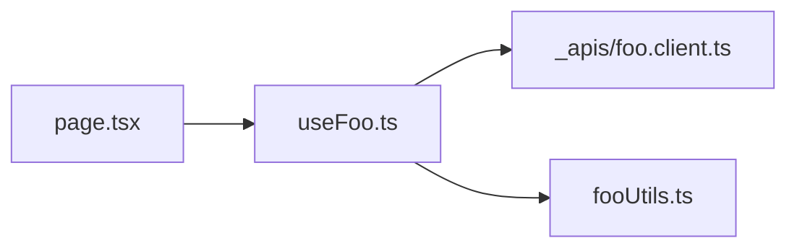
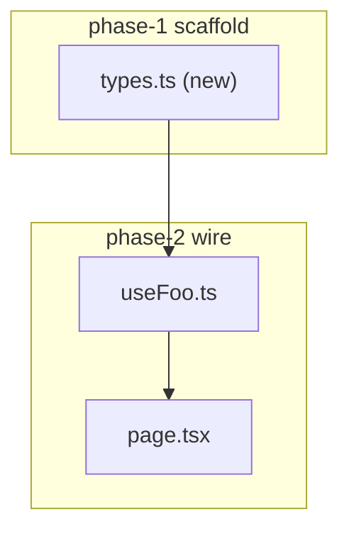
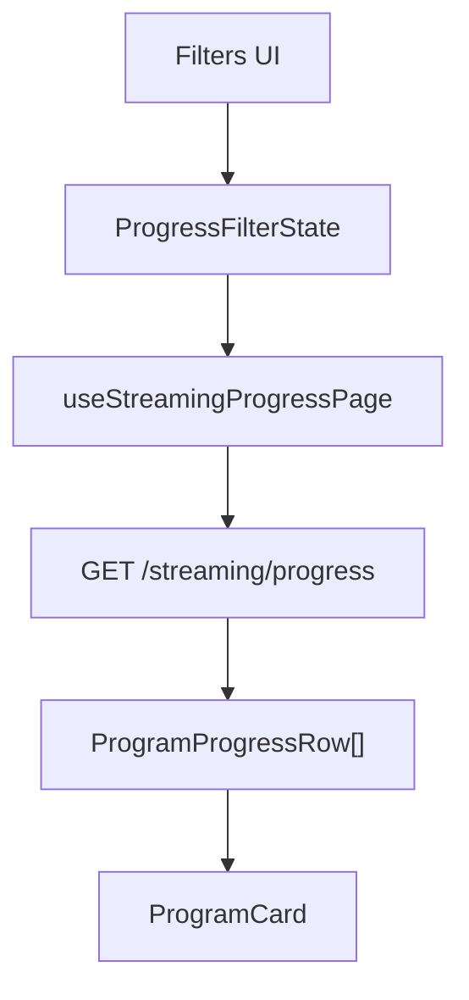
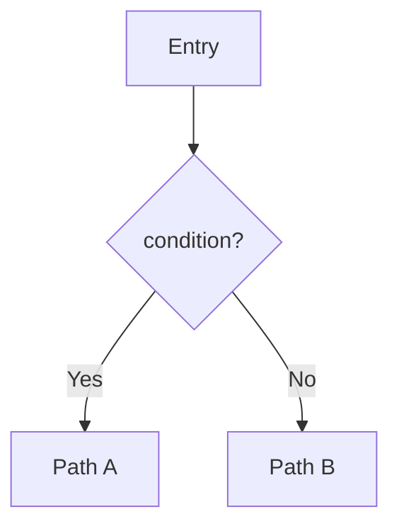

# Plan diagrams（Cursor Plan モード互換）

forge-mode がプランを出すときは、Cursor Plan モードの `.plan.md` と同じく **Mermaid を必須**にする。目的は変更ファイルとデータ流れを、チャット／Plan パネルで目視確認できるようにすること。

## いつ出すか

| 状況 | 必須図 |
|------|--------|
| Multi-phase plan（`references/plan.md`） | File change map + Data flow（overview に両方） |
| Feature / Bug fix / Refactoring で触るファイルが2以上、または境界をまたぐ | 同上（実装 delegate 前） |
| 1ファイル・自明 | skip 可。1行 `diagrams skipped: <reason>` |

Investigation（読み取り専用）は任意。フロー説明に効くときだけ How It Works に載せる。

## Plan 成果物の置き方

優先順:

1. **CreatePlan** が使える（Plan モード）→ CreatePlan で書く。overview / plan 本文に下記 Mermaid を含める。
2. Agent モード → 返信に Mermaid を出し、可能なら `~/.cursor/plans/<slug>.plan.md` にも同じ内容を書く（YAML frontmatter 付き）。

### Frontmatter 形（CreatePlan / `.plan.md`）

```yaml
---
name: <短いプラン名>
overview: <1〜2文の要約>
todos:
  - id: <slug>
    content: <検証可能な単位>
    status: pending
isProject: false
---
```

本文は Markdown。図は mermaid コードフェンスで書く。

## 必須図 1: File change map

触るファイルと関係（import / 呼び出し / 所有）を示す。ノードは **実パスまたはファイル名**。抽象レイヤ名だけにしない。



ルール:

- 新規は `(new)`、削除は `(delete)`、変更のみはラベルなしでよい
- フェーズ分割するときは subgraph で phase を分ける
- 触らないが参照する既存ファイルは薄い依存として1ホップまで

フェーズ付き例:



## 必須図 2: Data flow

入力 → 変換 → 出力（または UI → hook → API → 表示）を示す。契約（データ形状）の名前をノード／エッジに載せる（[`foundational-thinking`](../principles/foundational-thinking.md)）。



分岐・バグ経路があるときは `flowchart TD` で条件ノードを使う（Cursor Plan の既存プランと同じ）。



時系列の呼び出しが本体なら `sequenceDiagram` でもよい。どちらか一方で足りるなら無理に両方出さない（File change map と Data flow の2種は別）。

## チャット返信での出し方

プランを hand back するとき、散文の前または直後に両方の Mermaid を置く。ファイル一覧の箇条書きだけで図を省略しない。

必須見出し（この順）:

1. `## File change map` + mermaid flowchart（ファイルノード）
2. `## Data flow` + mermaid flowchart / sequenceDiagram（契約・データの流れ）

CreatePlan / `.plan.md` 本文でも同じ2見出しを使うと、Plan パネルでそのまま確認できる。

## 禁止

- 図なしの「変更ファイル: a, b, c」だけのプラン（2ファイル以上のとき）
- 実ファイルに紐づかない箱だけのアーキテクチャ図
- 実装後に初めて図を出す（確認用は **実装前**）

