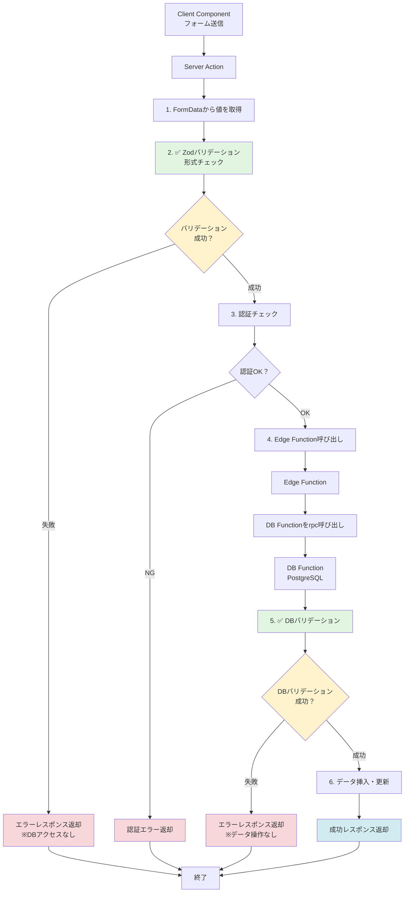

## 9. フォーム実装・データ更新処理規約

フォーム実装とデータ更新処理における統一的な実装パターンを定義します。

### 9.1 基本原則

#### 9.1.1 Server/Client Componentの明確な分離

- **Server Component**: ページレイアウト、静的コンテンツ、データフェッチ
- **Client Component**: フォーム、ユーザーインタラクション、状態管理

```typescript
// ✅ 良い例：Server ComponentとClient Componentを分離
// page.tsx (Server Component)
import { NewTodoForm } from "./_components/NewTodoForm";

export default function TodoNewPage() {
  return (
    <div>
      <h1>新しいToDoを作成</h1>
      <NewTodoForm />  {/* Client Component */}
    </div>
  );
}

// _components/NewTodoForm/index.tsx (Client Component)
"use client";

export function NewTodoForm() {
  // フォームのロジック
}
```

```typescript
// ❌ 悪い例：ページ全体をClient Componentにする
"use client";

export default function TodoNewPage() {
  // すべてのコンテンツがClient Componentになってしまう
}
```

#### 9.1.2 Uncontrolled Componentの優先使用

フォーム実装では、**Uncontrolled Component**を優先的に使用します。

**理由**:
- 不要な再レンダリングを防ぎ、パフォーマンスが向上する
- コードがシンプルになる
- ブラウザネイティブのFormData APIを活用できる

```typescript
// ✅ 良い例：Uncontrolled Component
"use client";

export function NewTodoForm() {
  // stateで値を管理しない
  return (
    <form action={formAction}>
      <input name="title" type="text" />
      <input name="description" type="text" />
      <button type="submit">送信</button>
    </form>
  );
}
```

```typescript
// ❌ 悪い例：Controlled Component（必要ない場合）
"use client";

export function NewTodoForm() {
  const [title, setTitle] = useState("");
  const [description, setDescription] = useState("");

  return (
    <form>
      <input 
        value={title} 
        onChange={(e) => setTitle(e.target.value)} 
      />
      <input 
        value={description} 
        onChange={(e) => setDescription(e.target.value)} 
      />
      <button type="submit">送信</button>
    </form>
  );
}
```

**バリデーション方針**:
- **Uncontrolled Component**: サーバーサイドバリデーション（Server Action + DB Function）のみに依存
  - HTML5バリデーション属性（`required`, `minLength`, `type="email"`など）は使用しない
  - シンプルで高速、Progressive Enhancementに対応
  
- **リアルタイムバリデーションが必要な場合**: `react-hook-form` + `zod` を使用
  - 入力値を即座に検証してフィードバックを表示したい場合
  - 入力値に応じてUIを動的に変更する必要がある場合
  - 詳細は「8.3.2 クライアントサイドバリデーション」を参照

#### 9.1.3 shadcn/ui SelectコンポーネントのUncontrolled化

shadcn/uiの`Select`コンポーネント（Radix UIベース）は、ネイティブの`select`タグではないため、直接`name`属性でFormDataに値を渡すことができません。Uncontrolled Componentパターンを実現するには、以下の方法を使用します：

**実装パターン**:
- `defaultValue`でデフォルト値を設定
- `useRef`でhiddenフィールドを参照
- `onValueChange`でhiddenフィールドの値を更新

```typescript
// ✅ 良い例：Uncontrolled Componentパターン
import { useRef } from "react";
import {
  Select,
  SelectContent,
  SelectItem,
  SelectTrigger,
  SelectValue,
} from "@/components/ui/select";

function FormComponent() {
  const priorityRef = useRef<HTMLInputElement>(null);

  function handlePriorityChange(value: string) {
    if (priorityRef.current) {
      priorityRef.current.value = value;
    }
  }

  return (
    <form action={formAction}>
      <Select defaultValue="medium" onValueChange={handlePriorityChange}>
        <SelectTrigger>
          <SelectValue placeholder="優先度を選択" />
        </SelectTrigger>
        <SelectContent>
          <SelectItem value="low">低</SelectItem>
          <SelectItem value="medium">中</SelectItem>
          <SelectItem value="high">高</SelectItem>
        </SelectContent>
      </Select>
      {/* FormDataに値を渡すためのhiddenフィールド */}
      <input type="hidden" name="priority" defaultValue="medium" ref={priorityRef} />
    </form>
  );
}
```

```typescript
// ❌ 悪い例：Controlled Componentパターン（不要なstate）
import { useState } from "react";

function FormComponent() {
  const [priority, setPriority] = useState("medium"); // 不要なstate

  return (
    <form action={formAction}>
      <Select value={priority} onValueChange={setPriority}>
        {/* ... */}
      </Select>
      <input type="hidden" name="priority" value={priority} />
    </form>
  );
}
```

### 9.2 useActionStateを使用したフォーム実装

#### 9.2.1 基本パターン

Next.jsの`useActionState`を使用して、Server Actionsとフォームを統合します。

**実装手順**:
1. Server Action を作成（`_actions/`ディレクトリ）
2. Client Componentで`useActionState`を使用
3. `<form>`の`action`プロップスにServer Actionを渡す

#### 9.2.2 Server Actionの実装

```typescript
// _actions/todo.ts
"use server";

import { z } from "zod";
import { createClient } from "@/services/supabase/server";

// バリデーションスキーマ
const CreateTodoFormSchema = z.object({
  title: z.string().min(1, "タイトルは必須です").max(100),
  description: z.string().max(1000).optional().nullable(),
  priority: z.enum(["low", "medium", "high"]),
});

// 状態型
export type CreateTodoState = {
  success: boolean;
  message: string;
  error?: string;
  fieldErrors?: {
    title?: string[];
    description?: string[];
    priority?: string[];
  };
};

// Server Action（useActionState対応）
export async function createTodo(
  _prevState: CreateTodoState,  // 第一引数は前回の状態（未使用の場合は_を付ける）
  formData: FormData,            // 第二引数はフォームデータ
): Promise<CreateTodoState> {
  try {
    // 1. FormDataから値を取得
    const rawFormData = {
      title: formData.get("title"),
      description: formData.get("description") || null,
      priority: formData.get("priority"),
    };

    // 2. Zodでバリデーション
    const validationResult = CreateTodoFormSchema.safeParse(rawFormData);

    if (!validationResult.success) {
      const fieldErrors = validationResult.error.flatten().fieldErrors;
      return {
        success: false,
        message: fieldErrors.title?.[0] || "入力内容が不正です",
        error: "VALIDATION_ERROR",
        fieldErrors,
      };
    }

    // 3. バリデーション済みデータを使用
    const validatedData = validationResult.data;

    // 4. 認証チェック
    const supabase = await createClient();
    const { data: { user }, error: userError } = await supabase.auth.getUser();

    if (userError || !user) {
      return {
        success: false,
        message: "認証に失敗しました",
        error: "AUTH_ERROR",
      };
    }

    // 5. データベース操作（Edge Function経由）
    // ... API呼び出しロジック

    return {
      success: true,
      message: "ToDoを作成しました",
    };
  } catch (error) {
    console.error("[EXCEPTION] ToDo作成エラー:", error);
    return {
      success: false,
      message: "予期しないエラーが発生しました",
      error: "UNEXPECTED_ERROR",
    };
  }
}
```

#### 9.2.3 Client Componentの実装

```typescript
// _components/NewTodoForm/index.tsx
"use client";

import { useRouter } from "next/navigation";
import { useActionState, useEffect, useRef } from "react";
import { Button } from "@/components/ui/button";
import { Input } from "@/components/ui/input";
import { Label } from "@/components/ui/label";
import {
  Select,
  SelectContent,
  SelectItem,
  SelectTrigger,
  SelectValue,
} from "@/components/ui/select";
import { createTodo, type CreateTodoState } from "../../_actions/todo";

const initialState: CreateTodoState = {
  success: false,
  message: "",
};

export function NewTodoForm() {
  const router = useRouter();
  const priorityRef = useRef<HTMLInputElement>(null);
  
  // useActionStateでServer Actionを統合
  const [state, formAction, pending] = useActionState(createTodo, initialState);

  // 成功時のリダイレクト
  useEffect(() => {
    if (state.success) {
      router.push("/todos");
    }
  }, [state.success, router]);

  // Select値変更時にhiddenフィールドを更新
  function handlePriorityChange(value: string) {
    if (priorityRef.current) {
      priorityRef.current.value = value;
    }
  }

  return (
    <form action={formAction} className="space-y-6">
      {/* エラーメッセージ表示 */}
      {state.message && !state.success && (
        <div className="rounded-md bg-red-50 p-4" role="alert" aria-live="polite">
          <p className="text-sm text-red-800">{state.message}</p>
        </div>
      )}

      {/* タイトル入力 */}
      <div className="space-y-2">
        <Label htmlFor="title">
          タイトル <span className="text-red-500">*</span>
        </Label>
        <Input
          id="title"
          name="title"
          type="text"
          placeholder="例：週報を作成する"
          disabled={pending}
          aria-invalid={state.fieldErrors?.title ? "true" : "false"}
          aria-describedby={state.fieldErrors?.title ? "title-error" : undefined}
        />
        {state.fieldErrors?.title && (
          <p id="title-error" className="text-sm text-red-600">
            {state.fieldErrors.title[0]}
          </p>
        )}
      </div>

      {/* 優先度選択（Uncontrolled Component） */}
      <div className="space-y-2">
        <Label htmlFor="priority">優先度</Label>
        <Select
          defaultValue="medium"
          onValueChange={handlePriorityChange}
          disabled={pending}
        >
          <SelectTrigger id="priority" className="w-full">
            <SelectValue placeholder="優先度を選択" />
          </SelectTrigger>
          <SelectContent>
            <SelectItem value="low">低</SelectItem>
            <SelectItem value="medium">中</SelectItem>
            <SelectItem value="high">高</SelectItem>
          </SelectContent>
        </Select>
        {/* FormDataに値を渡すためのhiddenフィールド */}
        <input type="hidden" name="priority" defaultValue="medium" ref={priorityRef} />
      </div>

      {/* 送信ボタン */}
      <div className="flex justify-end gap-3">
        <Button type="button" variant="outline" onClick={() => router.back()} disabled={pending}>
          キャンセル
        </Button>
        <Button type="submit" disabled={pending}>
          {pending ? "作成中..." : "ToDoを作成"}
        </Button>
      </div>
    </form>
  );
}
```

### 9.3 バリデーション規約

#### 9.3.1 サーバーサイドバリデーション（必須）

すべてのフォーム入力は、**サーバーサイドでZodを使用してバリデーション**を実施します。

```typescript
// ✅ 良い例：Zodスキーマを定義してサーバー側でバリデーション
const CreateTodoFormSchema = z.object({
  title: z.string().min(1, "タイトルは必須です").max(100),
  description: z.string().max(1000).optional().nullable(),
  priority: z.enum(["low", "medium", "high"]),
});

const validationResult = CreateTodoFormSchema.safeParse(rawFormData);
```

#### 9.3.2 クライアントサイドバリデーション

**基本方針**: 特別な要件がない限り、HTML5ネイティブバリデーションは使用しない。

**理由**:
- HTML5バリデーションは拡張性に乏しい
- Zodバリデーションエラーとフィードバック形式に差異が生じる
- ユーザー体験（UX）を損なう可能性がある
- エラーメッセージのカスタマイズが困難

**推奨アプローチ**: クライアントサイドでリアルタイムバリデーションが必要な場合は、`react-hook-form` + `zod` を使用してサーバーサイドと同じバリデーションスキーマを共有する。

##### 9.3.2.1 react-hook-formとZodの統合（推奨）

リアルタイムバリデーションが必要な場合は、`react-hook-form`と`zod`を組み合わせて使用します。

```typescript
// ✅ 良い例：react-hook-form + zodでクライアントサイドバリデーション
"use client";

import { useForm } from "react-hook-form";
import { zodResolver } from "@hookform/resolvers/zod";
import { z } from "zod";
import { Button } from "@/components/ui/button";
import { Input } from "@/components/ui/input";
import { Label } from "@/components/ui/label";

// サーバーサイドと同じZodスキーマを使用（スキーマの共有）
const CreateUserFormSchema = z.object({
  email: z.string().email("有効なメールアドレスを入力してください"),
  username: z.string().min(3, "ユーザー名は3文字以上必要です").max(20, "ユーザー名は20文字以内で入力してください"),
  age: z.number().int().min(18, "18歳以上である必要があります").max(120),
});

type FormData = z.infer<typeof CreateUserFormSchema>;

export function CreateUserForm() {
  const {
    register,
    handleSubmit,
    formState: { errors, isSubmitting },
  } = useForm<FormData>({
    resolver: zodResolver(CreateUserFormSchema),
    mode: "onBlur", // フォーカスを外したときにバリデーション
  });

  async function onSubmit(data: FormData) {
    // Server Actionを呼び出し
    const result = await createUser(data);
    // ...
  }

  return (
    <form onSubmit={handleSubmit(onSubmit)} className="space-y-6">
      {/* メールアドレス */}
      <div className="space-y-2">
        <Label htmlFor="email">
          メールアドレス <span className="text-red-500">*</span>
        </Label>
        <Input
          id="email"
          type="text"
          {...register("email")}
          aria-invalid={errors.email ? "true" : "false"}
          aria-describedby={errors.email ? "email-error" : undefined}
        />
        {errors.email && (
          <p id="email-error" className="text-sm text-red-600" role="alert">
            {errors.email.message}
          </p>
        )}
      </div>

      {/* ユーザー名 */}
      <div className="space-y-2">
        <Label htmlFor="username">
          ユーザー名 <span className="text-red-500">*</span>
        </Label>
        <Input
          id="username"
          type="text"
          {...register("username")}
          aria-invalid={errors.username ? "true" : "false"}
          aria-describedby={errors.username ? "username-error" : undefined}
        />
        {errors.username && (
          <p id="username-error" className="text-sm text-red-600" role="alert">
            {errors.username.message}
          </p>
        )}
      </div>

      {/* 年齢 */}
      <div className="space-y-2">
        <Label htmlFor="age">
          年齢 <span className="text-red-500">*</span>
        </Label>
        <Input
          id="age"
          type="number"
          {...register("age", { valueAsNumber: true })}
          aria-invalid={errors.age ? "true" : "false"}
          aria-describedby={errors.age ? "age-error" : undefined}
        />
        {errors.age && (
          <p id="age-error" className="text-sm text-red-600" role="alert">
            {errors.age.message}
          </p>
        )}
      </div>

      <Button type="submit" disabled={isSubmitting}>
        {isSubmitting ? "送信中..." : "送信"}
      </Button>
    </form>
  );
}
```

##### 9.3.2.2 Zodスキーマの共有

クライアントサイドとサーバーサイドで同じZodスキーマを使用することで、バリデーションロジックの一貫性を保ちます。

```typescript
// src/schemas/user.ts（共有スキーマ）
import { z } from "zod";

export const CreateUserFormSchema = z.object({
  email: z.string().email("有効なメールアドレスを入力してください"),
  username: z.string().min(3, "ユーザー名は3文字以上必要です").max(20, "ユーザー名は20文字以内で入力してください"),
  age: z.number().int().min(18, "18歳以上である必要があります").max(120),
});

export type CreateUserFormData = z.infer<typeof CreateUserFormSchema>;
```

```typescript
// _actions/user.ts（Server Action）
"use server";

import { CreateUserFormSchema } from "@/schemas/user";

export async function createUser(formData: FormData) {
  // 同じスキーマでバリデーション
  const validationResult = CreateUserFormSchema.safeParse({
    email: formData.get("email"),
    username: formData.get("username"),
    age: parseInt(formData.get("age") as string, 10),
  });

  // ...
}
```

```typescript
// _components/CreateUserForm/index.tsx（Client Component）
"use client";

import { useForm } from "react-hook-form";
import { zodResolver } from "@hookform/resolvers/zod";
import { CreateUserFormSchema, type CreateUserFormData } from "@/schemas/user";

export function CreateUserForm() {
  const { register, handleSubmit, formState: { errors } } = useForm<CreateUserFormData>({
    resolver: zodResolver(CreateUserFormSchema), // 同じスキーマを使用
  });

  // ...
}
```

##### 9.3.2.3 HTML5バリデーション属性の使用について

HTML5バリデーション属性（`required`, `minLength`, `maxLength`, `type="email"` など）は、**特別な要件がない限り使用しない**こととします。

```typescript
// ❌ 悪い例：HTML5バリデーション属性を使用
<Input
  name="email"
  type="email"       // HTML5バリデーション
  required           // HTML5バリデーション
  minLength={3}      // HTML5バリデーション
/>
```

```typescript
// ✅ 良い例：Zodバリデーションのみを使用
<Input
  name="email"
  type="text"  // type="email"は使わない（Zodでバリデーション）
  {...register("email")}
/>
```

**例外**: 以下の場合に限り、HTML5バリデーション属性の使用を許可します：
- プロトタイプやPoCなど、短期間で開発する必要がある場合
- 非常にシンプルなフォーム（1〜2項目程度）で、バリデーションロジックが単純な場合
- プロジェクトチーム内で合意が得られた場合

#### 9.3.3 Server Actionでのバリデーション戦略

Server Actionでは、バリデーションを**2段階**に分けて実施します。

**バリデーション戦略の概要**:

```
1. Server Action でのZodバリデーション（形式チェック）
   ↓
2. DB Function でのDBバリデーション（DB参照が必要なチェック）
```

##### 9.3.3.1 Zodバリデーション（Server Action）

**実施タイミング**: Server Actionで、**DBアクセスの前**に実施

**対象**:
- 入力値の形式チェック（メールアドレス、URL、日付など）
- 必須項目チェック
- 文字数制限
- 数値範囲チェック
- 列挙型（enum）の値チェック
- DB参照が不要な業務ルール

**目的**:
- ユーザーに**早くレスポンス**を返す（DBアクセス前にエラーを返せる）
- 不正なデータでDBアクセスを行わない（パフォーマンス向上）
- 型安全性の確保

```typescript
// ✅ 良い例：Server ActionでZodバリデーションを実施
"use server";

import { z } from "zod";
import { createClient } from "@/services/supabase/server";

// Zodスキーマ定義
const CreateUserFormSchema = z.object({
  email: z.string().email("有効なメールアドレスを入力してください"),
  username: z.string().min(3, "ユーザー名は3文字以上必要です").max(20, "ユーザー名は20文字以内で入力してください"),
  age: z.number().int().min(18, "18歳以上である必要があります").max(120),
  role: z.enum(["admin", "user", "guest"], {
    errorMap: () => ({ message: "無効な役割です" }),
  }),
});

export type CreateUserState = {
  success: boolean;
  message: string;
  error?: string;
  fieldErrors?: {
    email?: string[];
    username?: string[];
    age?: string[];
    role?: string[];
  };
};

export async function createUser(
  _prevState: CreateUserState,
  formData: FormData,
): Promise<CreateUserState> {
  try {
    // 1. FormDataから値を取得
    const rawFormData = {
      email: formData.get("email"),
      username: formData.get("username"),
      age: parseInt(formData.get("age") as string, 10),
      role: formData.get("role"),
    };

    // 2. ✅ Zodでバリデーション（DBアクセス前）
    const validationResult = CreateUserFormSchema.safeParse(rawFormData);

    if (!validationResult.success) {
      const fieldErrors = validationResult.error.flatten().fieldErrors;
      return {
        success: false,
        message: fieldErrors.email?.[0] || fieldErrors.username?.[0] || "入力内容が不正です",
        error: "VALIDATION_ERROR",
        fieldErrors,
      };
    }

    // 3. バリデーション済みデータを使用
    const validatedData = validationResult.data;

    // 4. 認証チェック
    const supabase = await createClient();
    const { data: { user }, error: userError } = await supabase.auth.getUser();

    if (userError || !user) {
      return {
        success: false,
        message: "認証に失敗しました",
        error: "AUTH_ERROR",
      };
    }

    // 5. Edge Function経由でDB Functionを呼び出し（DBバリデーションはDB Function内で実施）
    const { data: { session } } = await supabase.auth.getSession();
    if (!session) {
      return {
        success: false,
        message: "セッションが見つかりません",
        error: "SESSION_ERROR",
      };
    }

    const supabaseUrl = process.env.NEXT_PUBLIC_SUPABASE_URL;
    const response = await fetch(`${supabaseUrl}/functions/v1/create-user`, {
      method: "POST",
      headers: {
        "Content-Type": "application/json",
        Authorization: `Bearer ${session.access_token}`,
      },
      body: JSON.stringify(validatedData),
    });

    if (!response.ok) {
      const errorData = await response.json();
      return {
        success: false,
        message: errorData.error || "ユーザー作成に失敗しました",
        error: "API_ERROR",
      };
    }

    const result = await response.json();

    if (!result.success) {
      return {
        success: false,
        message: result.error || "ユーザー作成に失敗しました",
        error: "DB_ERROR",
      };
    }

    return {
      success: true,
      message: "ユーザーを作成しました",
    };
  } catch (error) {
    console.error("[EXCEPTION] ユーザー作成エラー:", error);
    return {
      success: false,
      message: "予期しないエラーが発生しました",
      error: "UNEXPECTED_ERROR",
    };
  }
}
```

##### 9.3.3.2 DBバリデーション（DB Function）

**実施タイミング**: DB Functionで、**データベース操作の前**に実施

**対象**:
- データベースの値を参照しないとできないチェック
  - 重複チェック（例：メールアドレス、ユーザー名の重複）
  - 外部キー制約の確認（例：指定されたIDが存在するか）
  - 関連データの状態チェック（例：注文可能な商品かどうか）
  - 権限チェック（例：特定のリソースにアクセス権があるか）
  - 業務ロジックに基づくDB整合性チェック

**目的**:
- データベースの整合性を保つ
- 複雑な業務ルールをデータベース層で強制
- トランザクション内でのバリデーションとデータ更新の原子性を保証

```sql
-- ✅ 良い例：DB FunctionでDBバリデーションを実施
-- ファイル: supabase/migrations/20251108000001_create_function_ins_user.sql

CREATE OR REPLACE FUNCTION ins_user(
    p_email TEXT,
    p_username TEXT,
    p_age INTEGER,
    p_role TEXT,
    p_auth_user_id UUID
) RETURNS JSONB
LANGUAGE plpgsql
SECURITY DEFINER
AS $$
DECLARE
    v_user_id UUID;
    v_result JSONB;
BEGIN
    -- 1. ✅ DBバリデーション：メールアドレスの重複チェック
    IF EXISTS (SELECT 1 FROM m_user WHERE email = p_email AND deleted_at IS NULL) THEN
        RETURN jsonb_build_object(
            'success', false,
            'error', 'このメールアドレスは既に使用されています'
        );
    END IF;

    -- 2. ✅ DBバリデーション：ユーザー名の重複チェック
    IF EXISTS (SELECT 1 FROM m_user WHERE username = p_username AND deleted_at IS NULL) THEN
        RETURN jsonb_build_object(
            'success', false,
            'error', 'このユーザー名は既に使用されています'
        );
    END IF;

    -- 3. ✅ DBバリデーション：認証ユーザーIDの存在チェック
    IF NOT EXISTS (SELECT 1 FROM auth.users WHERE id = p_auth_user_id) THEN
        RETURN jsonb_build_object(
            'success', false,
            'error', '認証ユーザーが見つかりません'
        );
    END IF;

    -- 4. データ挿入（バリデーション通過後）
    INSERT INTO m_user (email, username, age, role, auth_user_id, created_at, updated_at)
    VALUES (p_email, p_username, p_age, p_role, p_auth_user_id, NOW(), NOW())
    RETURNING id INTO v_user_id;

    -- 5. 成功レスポンス
    RETURN jsonb_build_object(
        'success', true,
        'data', jsonb_build_object(
            'user_id', v_user_id,
            'email', p_email,
            'username', p_username
        )
    );

EXCEPTION
    WHEN OTHERS THEN
        -- エラーハンドリング
        RETURN jsonb_build_object(
            'success', false,
            'error', 'データベースエラーが発生しました: ' || SQLERRM
        );
END;
$$;
```

##### 9.3.3.3 バリデーション戦略の実装フロー



**フロー図の説明**:

| 項目 | 説明 |
|------|------|
| 🟢 **Zodバリデーション** | Server Actionで形式チェック（メールアドレス形式、必須項目、文字数制限、数値範囲）<br/>**メリット**: DBアクセス前にエラーを返せる |
| 🟡 **認証チェック** | Supabase認証でユーザー確認 |
| 🟢 **DBバリデーション** | DB Functionで整合性チェック（重複チェック、外部キー存在確認、権限チェック）<br/>**メリット**: データベース整合性を確実に保つ |
| 🔴 **エラー時** | バリデーション失敗時はデータ操作を行わずにエラーレスポンス返却 |
| 🔵 **成功時** | すべてのバリデーション通過後にデータ挿入・更新 |

##### 9.3.3.4 バリデーション戦略のメリット

| 項目 | 説明 |
|------|------|
| **早期エラー返却** | Zodバリデーションで形式エラーをDBアクセス前に返せるため、ユーザー体験が向上 |
| **パフォーマンス** | 不正なデータでDBアクセスを行わないため、無駄なクエリを削減 |
| **データ整合性** | DB FunctionでDBバリデーションを行うことで、データベースの整合性を確実に保つ |
| **責務の分離** | Server Action（入力チェック）とDB Function（DB整合性チェック）で責務を明確に分離 |
| **セキュリティ** | Server ActionとDB Functionの二重チェックにより、セキュリティが向上 |

#### 9.3.4 エラー表示とアクセシビリティ

フィールドごとのエラーメッセージを表示し、アクセシビリティに配慮します。

```typescript
// ✅ 良い例：アクセシビリティに配慮したエラー表示
import { Input } from "@/components/ui/input";
import { Label } from "@/components/ui/label";

<div className="space-y-2">
  <Label htmlFor="title">タイトル</Label>
  <Input
    id="title"
    name="title"
    type="text"
    aria-invalid={state.fieldErrors?.title ? "true" : "false"}
    aria-describedby={state.fieldErrors?.title ? "title-error" : undefined}
  />
  {state.fieldErrors?.title && (
    <p id="title-error" className="text-sm text-red-600" role="alert">
      {state.fieldErrors.title[0]}
    </p>
  )}
</div>
```

### 9.4 Pending状態の管理

#### 9.4.1 useActionStateのpendingを使用

```typescript
// ✅ 良い例：useActionStateからpendingを取得
import { Button } from "@/components/ui/button";
import { Input } from "@/components/ui/input";

const [state, formAction, pending] = useActionState(createTodo, initialState);

return (
  <form action={formAction} className="space-y-4">
    <Input name="title" disabled={pending} />
    <Button type="submit" disabled={pending}>
      {pending ? "送信中..." : "送信"}
    </Button>
  </form>
);
```

#### 9.4.2 useFormStatusの使用（代替パターン）

送信ボタンを別コンポーネントに分離する場合は`useFormStatus`を使用できます。

```typescript
// SubmitButton.tsx
"use client";

import { useFormStatus } from "react-dom";
import { Button } from "@/components/ui/button";

export function SubmitButton() {
  const { pending } = useFormStatus();

  return (
    <Button type="submit" disabled={pending}>
      {pending ? "送信中..." : "送信"}
    </Button>
  );
}

// NewTodoForm.tsx
import { Input } from "@/components/ui/input";
import { SubmitButton } from "./SubmitButton";

export function NewTodoForm() {
  return (
    <form action={formAction} className="space-y-4">
      {/* フォームフィールド */}
      <Input name="title" />
      <SubmitButton />
    </form>
  );
}
```

### 9.5 ファイル配置規約

#### 9.5.1 ディレクトリ構造

```
app/(dashboard)/todos/new/
├── _actions/              # Server Actions
│   └── todo.ts           # ToDo関連のServer Actions
├── _components/          # Client Components
│   └── NewTodoForm/
│       └── index.tsx
└── page.tsx              # Server Component（ページ）
```

#### 9.5.2 命名規則

- **Server Actions**: `_actions/<リソース名>.ts`
- **Client Components**: `_components/<コンポーネント名>/index.tsx`
- **状態型**: `<Action名>State`（例: `CreateTodoState`）

### 9.6 更新処理の実装パターン

#### 9.6.1 編集フォームの実装

編集フォームでは、初期値を設定する必要があります。

```typescript
// page.tsx (Server Component)
import { getTodo } from "./_apis/todo.server";
import { EditTodoForm } from "./_components/EditTodoForm";

export default async function TodoEditPage({ params }: { params: { id: string } }) {
  // サーバー側でデータを取得
  const todo = await getTodo(params.id);

  if (!todo) {
    return <div>ToDoが見つかりません</div>;
  }

  return (
    <div>
      <h1>ToDoを編集</h1>
      <EditTodoForm initialData={todo} />
    </div>
  );
}

// _components/EditTodoForm/index.tsx (Client Component)
"use client";

import { useActionState, useRef } from "react";
import { Button } from "@/components/ui/button";
import { Input } from "@/components/ui/input";
import { Label } from "@/components/ui/label";
import {
  Select,
  SelectContent,
  SelectItem,
  SelectTrigger,
  SelectValue,
} from "@/components/ui/select";
import { updateTodo, type UpdateTodoState } from "../../_actions/todo";

type EditTodoFormProps = {
  initialData: {
    id: string;
    title: string;
    description: string | null;
    priority: "low" | "medium" | "high";
  };
};

export function EditTodoForm({ initialData }: EditTodoFormProps) {
  const [state, formAction, pending] = useActionState(updateTodo, { success: false, message: "" });
  const priorityRef = useRef<HTMLInputElement>(null);

  // Select値変更時にhiddenフィールドを更新
  function handlePriorityChange(value: string) {
    if (priorityRef.current) {
      priorityRef.current.value = value;
    }
  }

  return (
    <form action={formAction} className="space-y-6">
      {/* hiddenフィールドでIDを渡す */}
      <input type="hidden" name="id" value={initialData.id} />

      {/* defaultValueで初期値を設定 */}
      <div className="space-y-2">
        <Label htmlFor="title">タイトル</Label>
        <Input
          id="title"
          name="title"
          type="text"
          defaultValue={initialData.title}
          disabled={pending}
        />
      </div>

      <div className="space-y-2">
        <Label htmlFor="description">説明</Label>
        <textarea
          id="description"
          name="description"
          defaultValue={initialData.description || ""}
          disabled={pending}
          className="w-full rounded-md border px-3 py-2"
        />
      </div>

      {/* 優先度選択（Uncontrolled Component） */}
      <div className="space-y-2">
        <Label htmlFor="priority">優先度</Label>
        <Select
          defaultValue={initialData.priority}
          onValueChange={handlePriorityChange}
          disabled={pending}
        >
          <SelectTrigger id="priority" className="w-full">
            <SelectValue placeholder="優先度を選択" />
          </SelectTrigger>
          <SelectContent>
            <SelectItem value="low">低</SelectItem>
            <SelectItem value="medium">中</SelectItem>
            <SelectItem value="high">高</SelectItem>
          </SelectContent>
        </Select>
        {/* FormDataに値を渡すためのhiddenフィールド */}
        <input
          type="hidden"
          name="priority"
          defaultValue={initialData.priority}
          ref={priorityRef}
        />
      </div>

      <div className="flex justify-end gap-3">
        <Button type="submit" disabled={pending}>
          {pending ? "更新中..." : "更新"}
        </Button>
      </div>
    </form>
  );
}
```

### 9.7 削除処理の実装パターン

#### 9.7.1 確認ダイアログを含む削除

```typescript
// _components/DeleteTodoButton/index.tsx
"use client";

import { useTransition } from "react";
import { Button } from "@/components/ui/button";
import { deleteTodo } from "../../_actions/todo";

type DeleteTodoButtonProps = {
  todoId: string;
  todoTitle: string;
};

export function DeleteTodoButton({ todoId, todoTitle }: DeleteTodoButtonProps) {
  const [isPending, startTransition] = useTransition();

  function handleDelete() {
    // 確認ダイアログを表示
    if (!confirm(`「${todoTitle}」を削除しますか？`)) {
      return;
    }

    // 削除処理を実行
    startTransition(async () => {
      const result = await deleteTodo(todoId);
      if (result.success) {
        // 成功時の処理（例：リダイレクト）
        window.location.href = "/todos";
      } else {
        alert(result.message);
      }
    });
  }

  return (
    <Button
      type="button"
      variant="destructive"
      size="sm"
      onClick={handleDelete}
      disabled={isPending}
    >
      {isPending ? "削除中..." : "削除"}
    </Button>
  );
}
```

### 9.8 ベストプラクティス

#### 9.8.1 Server Actionの設計

- **単一責任**: 1つのServer Actionは1つの操作のみを実行
- **状態を返す**: 成功/失敗、メッセージ、エラー情報を含む状態オブジェクトを返す
- **型安全**: TypeScriptの型を活用し、入力と出力を明確にする

#### 9.8.2 エラーハンドリング

- **サーバー側で処理**: すべてのエラーをサーバー側でキャッチし、適切な状態を返す
- **ユーザーフレンドリー**: エラーメッセージは技術的な詳細を避け、ユーザーが理解しやすい表現にする
- **ログ出力**: デバッグ用に詳細なエラーログを出力する

```typescript
// ✅ 良い例：エラーハンドリング
try {
  // 処理
  return { success: true, message: "成功しました" };
} catch (error) {
  // 詳細ログ（開発者向け）
  console.error("[EXCEPTION] 処理エラー:", error);
  
  // ユーザー向けメッセージ
  return {
    success: false,
    message: "予期しないエラーが発生しました",
    error: "UNEXPECTED_ERROR",
  };
```

#### 9.8.3 Progressive Enhancement

フォームは、JavaScriptが無効でも基本的な機能が動作するように設計します。

```typescript
// ✅ 良い例：Progressive Enhancement
import { Button } from "@/components/ui/button";
import { Input } from "@/components/ui/input";

<form action={formAction}>  {/* JavaScriptが有効な場合はServer Action実行 */}
  {/* JavaScriptが無効でも、通常のフォーム送信として動作 */}
  {/* サーバーサイドバリデーションで入力チェックを行う */}
  <Input name="title" type="text" />
  <Button type="submit">送信</Button>
</form>
```

**注意**: HTML5バリデーション属性（`required`など）は使用せず、サーバーサイドバリデーションに依存します。これにより、JavaScriptの有効/無効に関わらず、一貫したバリデーション体験を提供できます。

### 9.9 アンチパターン

#### 9.9.1 避けるべきパターン

```typescript
import { Input } from "@/components/ui/input";
import { Button } from "@/components/ui/button";

// ❌ 悪い例1：onSubmitでフォームを処理（useActionStateを使うべき）
<form onSubmit={handleSubmit}>
  <Input name="title" />
</form>

// ❌ 悪い例2：不要なControlled Component
const [title, setTitle] = useState("");
<Input value={title} onChange={(e) => setTitle(e.target.value)} />

// ❌ 悪い例3：HTML5バリデーション属性を使用（使用禁止）
<Input
  name="email"
  type="email"       // HTML5バリデーション
  required           // HTML5バリデーション
  minLength={3}      // HTML5バリデーション
/>

// ❌ 悪い例4：クライアント側のみでバリデーション
function handleSubmit() {
  if (!title) {
    alert("タイトルは必須です");  // サーバー側でもバリデーションすべき
    return;
  }
}

// ❌ 悪い例5：エラー状態をuseStateで管理（useActionStateを使うべき）
const [error, setError] = useState("");
```

---
